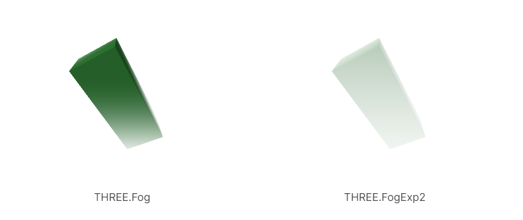

雾通常是基于 **离摄像机的指定距离褪色至某种特定颜色的方式**

添加雾是通过创建 **Fog** 或者 **FogExp2** 实例并设定**scene的fog属性**

设定 near 和 far 属性，代表距离摄像机的距离。

在 near 和 far 中间的物体，会从它们自身材料的颜色褪色到雾的颜色

```js
const scene = new THREE.Scene();
{
  const color = 0xFFFFFF;  // white
  const near = 10;
  const far = 100;
  scene.fog = new THREE.Fog(color, near, far);
}
```

