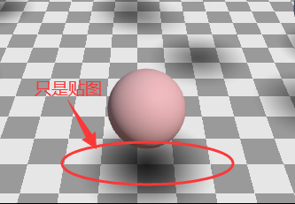
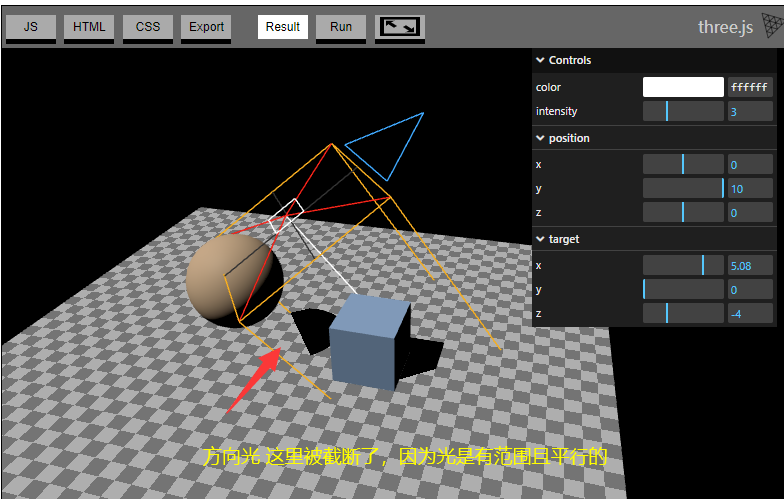
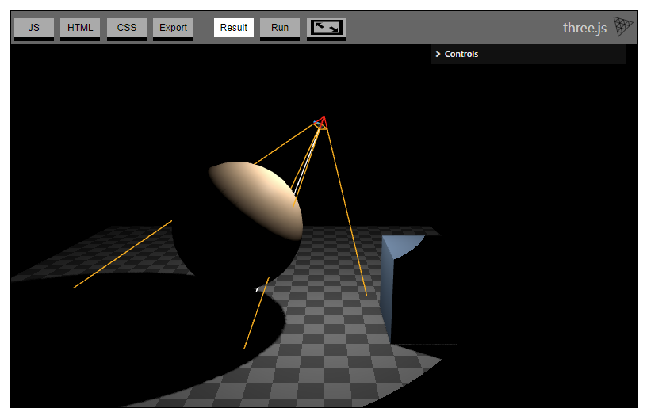
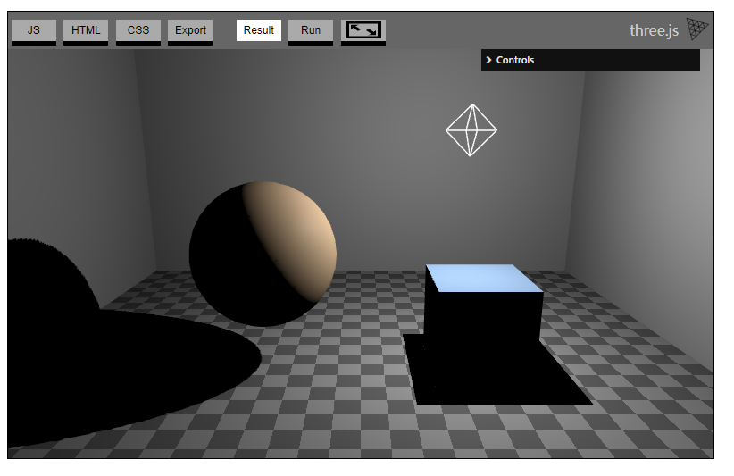

Three.js 默认使用 **shadow maps（阴影贴图）**

阴影贴图的工作方式：光能够从自身开始给物体渲染阴影。（光和物体都要设置投射属性）

每个光源在投射阴影时都会重新绘制场景，多个灯光分别绘制多次。  
常见解决方案：1. 允许多个光源，但只让一个光源投射阴影。 2. 使用光照贴图或者环境光贴图，但会导致静态光照

使用假阴影，例如在平面上放一个近似阴影的灰度纹理



有三种光可以投射阴影，分别为 **DirectionalLight 方向光**、 **PointLight 点光源**、**SpotLight 聚光灯**

有几个属性需要设置：

```js
// 1. 设置渲染器中的阴影属性
renderer.shadowMap.enabled = true;
// 2. 设置光 能投射阴影
const light = new THREE.DirectionalLight(color, intensity);
light.castShadow = true;
// 每个网格都能被设置是否 投射阴影 和 被投射阴影
// 3. 设置网格（地面）能被投射阴影
mesh.receiveShadow = true;
// 4. 设置球体和立方体都能投射阴影 和 被投射阴影
cubeMesh.castShadow = true;
cubeMesh.receiveShadow = true;
```
**DirectionalLight 方向光**:

类似正交相机



**SpotLight 聚光灯**

类似透视相机



**PointLight 点光源**

只需设置near和far，相当于6个面的聚光灯组合而成，场景的阴影渲染6次。

