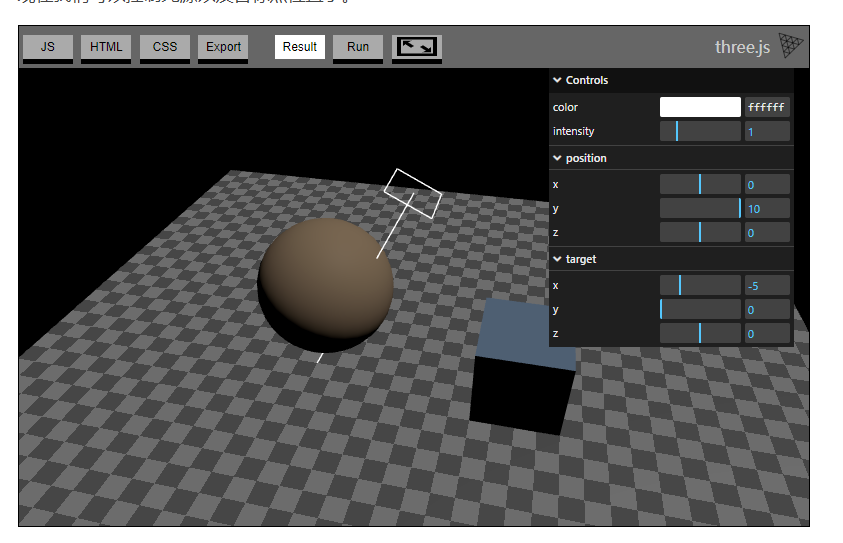
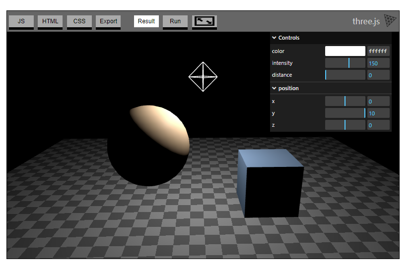
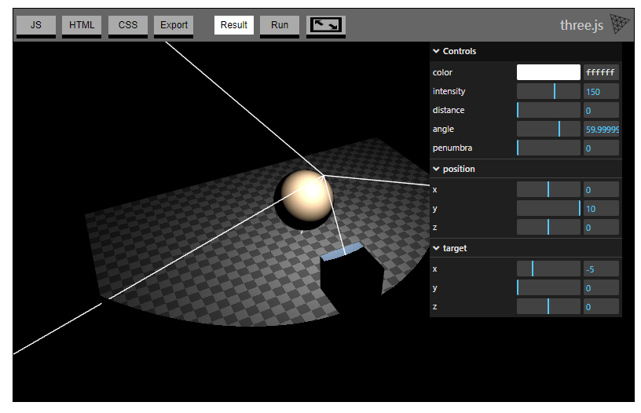
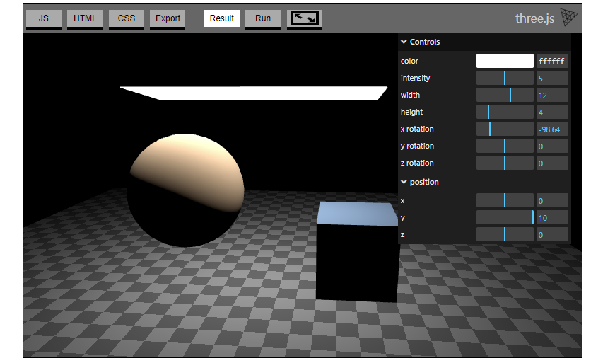

如何在 three.js 中使用各种不同类型的光照。

每添加一个光源到场景中，都会降低 three.js 渲染场景的速度，所以应该尽量使用最少的资源来实现想要的效果

Light https://threejs.org/docs/index.html#api/zh/lights/Light

光源的基类 - 所有其他的光类型都继承了该类描述的属性和方法。

1. 环境光（AmbientLight）

没有立体感,只是简单地将材质的颜色与光照颜色进行叠加

```js
const color = 0xFFFFFF;
const intensity = 1;
const light = new THREE.AmbientLight(color, intensity);
scene.add(light);
```

2. 半球光（HemisphereLight）

从天空到地面两个颜色之间的渐变，与物体材质的颜色作叠加后得到最终的颜色效果

一个点受到的光照颜色是由所在平面的朝向（法向量）决定的 —— 面向正上方就受到天空的光照颜色，面向正下方就受到地面的光照颜色，其他角度则是两个颜色渐变区间的颜色。

没有太大立体感，适合与其他光照结合使用

```js
const skyColor = 0xB1E1FF;  // light blue
const groundColor = 0xB97A20;  // brownish orange
const intensity = 1;
const light = new THREE.HemisphereLight(skyColor, groundColor, intensity);
scene.add(light);
```

3. 方向光（DirectionalLight）

常用来表现太阳光照的效果，光的方向是从它的位置照向目标点的位置。

```js
const color = 0xFFFFFF;
const intensity = 1;
const light = new THREE.DirectionalLight(color, intensity);
light.position.set(0, 10, 0);
light.target.position.set(-5, 0, 0);
scene.add(light);
scene.add(light.target);
```


4. 点光源（PointLight）

从一个点朝各个方向发射出光线的一种光照效果

```js
const color = 0xFFFFFF;
const intensity = 150;
const light = new THREE.PointLight(color, intensity);
light.position.set(0, 10, 0);
scene.add(light);

const helper = new THREE.PointLightHelper(light);
scene.add(helper);
```



5. 聚光灯（SpotLight）

一个点光源被一个圆锥体限制住了光照的范围

类似方向光（DirectionalLight）一样需要一个目标点，光源的位置是圆锥的顶点

```js
const color = 0xFFFFFF;
const intensity = 150;
const light = new THREE.SpotLight(color, intensity);
scene.add(light);
scene.add(light.target);
 
const helper = new THREE.SpotLightHelper(light);
scene.add(helper);
```




6. 矩形区域光（RectAreaLight）

矩形区域的发射出来的光照，例如长条的日光灯或者天花板上磨砂玻璃透进来的自然光

只能影响 MeshStandardMaterial 和 MeshPhysicalMaterial

```js
const color = 0xFFFFFF;
const intensity = 5;
const width = 12;
const height = 4;
const light = new THREE.RectAreaLight(color, intensity, width, height);
light.position.set(0, 10, 0);
light.rotation.x = THREE.MathUtils.degToRad(-90);
scene.add(light);
 
const helper = new RectAreaLightHelper(light);
light.add(helper);
```




* * *

先设置一下相机

```js
const fov = 45;
const aspect = 2;  // canvas 的默认宽高 300:150
const near = 0.1;
const far = 100;
const camera = new THREE.PerspectiveCamera(fov, aspect, near, far);
camera.position.set(0, 10, 20);
```

创建地平面用来打光

```js
const planeSize = 40;
 
const loader = new THREE.TextureLoader();
const texture = loader.load('resources/images/checker.png');
texture.wrapS = THREE.RepeatWrapping; // 设置重复模式
texture.wrapT = THREE.RepeatWrapping;
texture.magFilter = THREE.NearestFilter;  // 采样模式 - 当一个纹理元素大于一个像素时，贴图如何采样
texture.colorSpace = THREE.SRGBColorSpace;
const repeats = planeSize / 2;  // 重复的次数
texture.repeat.set(repeats, repeats);

const planeGeo = new THREE.PlaneGeometry(planeSize, planeSize);
const planeMat = new THREE.MeshPhongMaterial({
  map: texture,
  side: THREE.DoubleSide,
});
const mesh = new THREE.Mesh(planeGeo, planeMat);
// 旋转90° 得到一个 XZ 平面
mesh.rotation.x = Math.PI * -.5;
scene.add(mesh);

// 添加一个立方体和球体 用于打光
{
  const cubeSize = 4;
  const cubeGeo = new THREE.BoxGeometry(cubeSize, cubeSize, cubeSize);
  const cubeMat = new THREE.MeshPhongMaterial({color: '#8AC'});
  const mesh = new THREE.Mesh(cubeGeo, cubeMat);
  mesh.position.set(cubeSize + 1, cubeSize / 2, 0);
  scene.add(mesh);
}
{
  const sphereRadius = 3;
  const sphereWidthDivisions = 32;
  const sphereHeightDivisions = 16;
  const sphereGeo = new THREE.SphereGeometry(sphereRadius, sphereWidthDivisions, sphereHeightDivisions);
  const sphereMat = new THREE.MeshPhongMaterial({color: '#CA8'});
  const mesh = new THREE.Mesh(sphereGeo, sphereMat);
  mesh.position.set(-sphereRadius - 1, sphereRadius + 2, 0);
  scene.add(mesh);
}
```