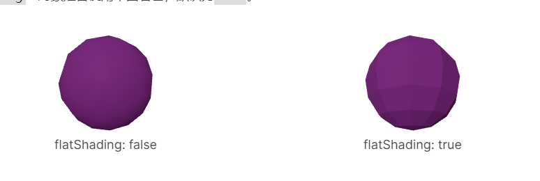
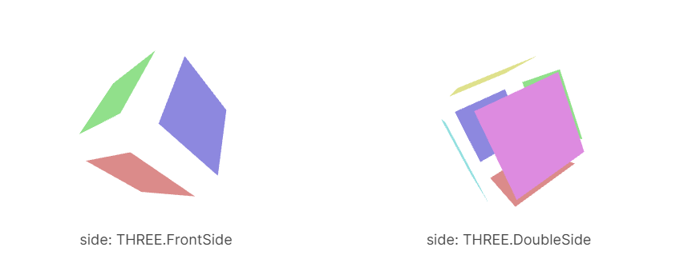
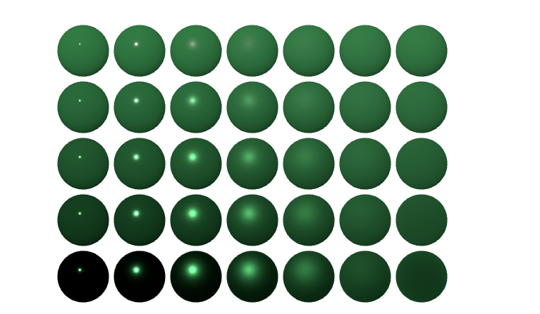
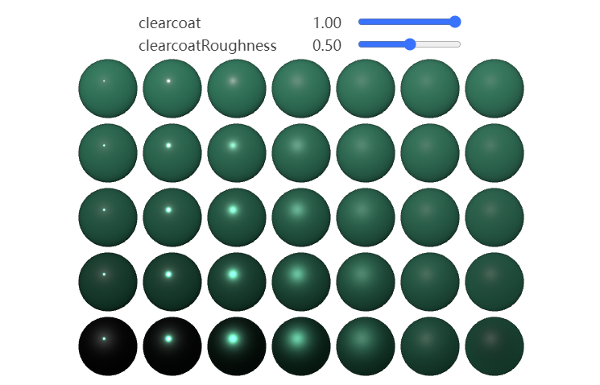

Three.js提供了多种类型的 **材质（material）**。它们定义了对象在场景中的外型。你使用哪种材质取决于你想达到的目的

关于材质我们还要更多考虑到纹理，它为我们提供了大量选择。

> 总结：材质有很多种类型，越真实的材质支持的功能越多 构建速度越慢，我们根据场景需要进行选择

材质的构建速度从最快到最慢： `MeshBasicMaterial` ➡ `MeshLambertMaterial` ➡ `MeshPhongMaterial` ➡ `MeshStandardMaterial` ➡ `MeshPhysicalMaterial`

可以在初始化时设置材质，也可以在实例化后设置材质
```js
const material = new THREE.MeshPhongMaterial({
  color: 0xFF0000,
});

const material = new THREE.MeshPhongMaterial();
material.color.setHSL(0, 1, .5);  // 红色
```

`material.flatShading` 是否对平面着色


`material.side` 要显示三角形的哪个面。默认值是 THREE.FrontSide，其他选项有 THREE.BackSide 和 THREE.DoubleSide（正反两面）


* `MeshBasicMaterial` 基础网格材质，不受光照的影响
* `MeshLambertMaterial` 只在顶点计算光照
* `MeshPhongMaterial` 则在每个像素计算光照、还支持**镜面高光**
* `MeshStandardMaterial` 标准网格材质 使用**粗糙度和金属度**

* `MeshPhysicalMaterial` 物理网格材质，相比标准材质增加了 **`clearcoat`和反射、折射**

* `MeshDepthMaterial` 渲染每个像素的深度
* `MeshNormalMaterial` 会显示几何体的法线

> 在设置flatShading 或者 添加/删除纹理之后，需要调用material.needUpdate = true，否则某些材质只会被渲染一次