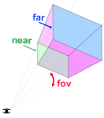

在three.js中最常用的摄像机是 **透视摄像机 PerspectiveCamera**

PerspectiveCamera通过四个属性来定义一个视锥。near定义了视锥的前端，far定义了后端，fov是视野，通过计算正确的高度来从摄像机的位置获得指定的以near为单位的视野

为什么near不设置0.000000001 far设置10000000，将一切尽收眼底呢？

GPU没有足够的精度判断一个东西在前面还是后面。在默认情况下，离摄像机近的将会更清晰，离摄像机远的模糊

你需要选择**好好抉择near和far的设置，来和你的场景配合**。既不丢失重要的近景，也不让远处的东西消失不见

第二种常见的摄像机是**正交摄像机 OrthographicCamera**，和指定一个视锥不同的是，它需要设置left，right top，bottom，near，和far指定一个长方体

常见的用途是用OrthographicCamera来展示模型的三视图