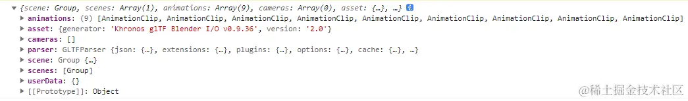
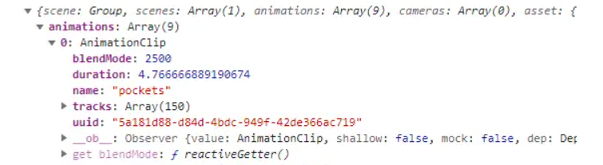

Threejs骨骼动画需要通过骨骼网格模型类SkinnedMesh来实现，一般来说骨骼动画模型都是3D美术创建，然后程序员通过threejs引擎加载解析。

`SkinnedMesh`：具有Skeleton（骨架）和bones（骨骼）的网格，可用于给几何体上的顶点添加动画

`Bone`：骨骼是Skeleton（骨架）的一部分。骨架是由SkinnedMesh（蒙皮网格）依次来使用的。 骨骼几乎和空白Object3D相同。

骨骼使用`SkinnedMesh`和`Bone`类型的数据



animations是一个动画数组，其中包含着多个**AnimationClip**，每个AnimationClip都是一个完整的动画数据



* blendMode 混合模式（暂未确定干什么用的，可能是这个，要翻墙 动画混合模式）
* duration 动画时长，单位为秒（上面的数据就是4.76秒）
* name 动画名称
* tracks 一个由关键帧轨道（KeyframeTracks）组成的数组，这个是动画动起来的关键，我们可以简单理解为里面的数据告诉模型的是每个时间点每个顶点要在什么位置，按时间轴去改变顶点位置来形成动画。
* uuid 实例的UUID，自动分配且不可编辑

**AnimationMixer**对于传入的模型是一个全局的动画控制器，可以对动画进行一个全局的管理。

```js
// 创建模型动作混合器
const mixer = new THREE.AnimationMixer(model);
```

**mixer.clipAction**：AnimationMixer的一个方法，返回所传入的剪辑参数的`AnimationAction`

```js
const action = mixer.clipAction(glb.animations[0]);
```

只有AnimationAction对象才能播放暂停动画，所有的剪辑剪辑对象AnimationClip必须通过AnimationAction来调度。

```js
action.play();
```