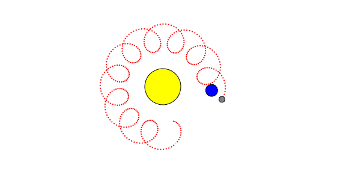
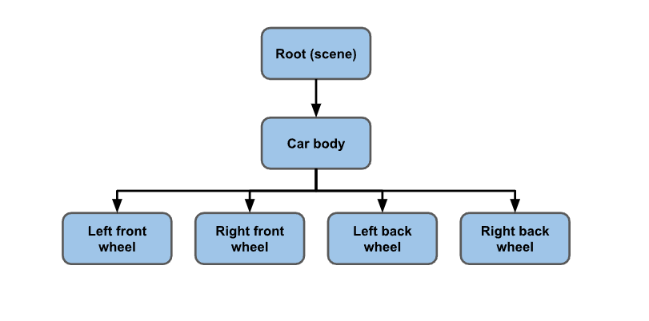
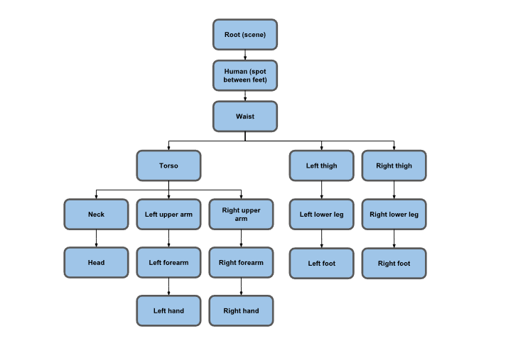

Three.js 的核心可以说是它的**场景图（scene graph）**

比如这样一个例子：太阳系、太阳、地球、月亮。

地球绕着太阳转，月球绕着地球转，月球绕着地球转了一圈。

- 从月球的角度看，它是在地球的 "局部空间 "中旋转
- 但月球相对于太阳的运动是一些疯狂的像螺线图一样的曲线
- 但从月球的角度来看，它只需要关注自身围绕地球这个局部空间的旋转
  

> 总结：我们要建立**有层次的局部坐标系** 给物体提供稳定的锚点 **只关心自己在局部坐标系中的位置**，否则我们的计算会非常困难
>
> 例如我们可以很简单的控制地球绕着太阳转，月亮绕着地球转  
> 但很难控制月亮绕着太阳转

比如跑道中存在一个汽车，当汽车移动时，我们不可能去单独计算每个轮子相对于跑道的位置，而是让轮子相对于汽车构成一个局部坐标系，在汽车移动时轮子跟着相对移动即可。

与此类似的还有世界中人类的每个手指、器官 相对于人这个模型物体形成局部坐标系。

